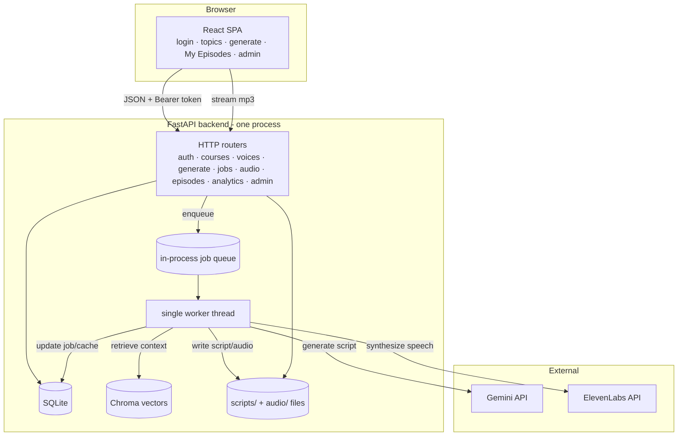

# Architecture — Podcast Generator, A to Z

This document explains the whole system: what each piece does, how a request flows end
to end, the data model, the caching that makes it cheap at scale, the security model, and
where everything is stored. It's meant to be read top to bottom once, then used as a
reference.

---

## 1. What the tool does

Students in a course log in, pick a **topic** and a **format** (monologue, interview,
two-host conversation, or debate), pick one or two **voices**, and generate a short
(admin-set, 5–20 min) English educational **podcast** grounded in the course's own
material. The script is written by an LLM against retrieved course text; the audio is
synthesized by a text-to-speech service. Every generated script and audio file is saved
and tied to the student. An admin dashboard shows per-student listening engagement and
controls a few global settings.

The design goal that shapes almost everything below: **many students share a few real
LLM/TTS calls.** Identical choices reuse cached results, so 100 students cost a handful of
generations, not 100.

---

## 2. The stack

| Layer | Technology |
|---|---|
| Frontend | React + TypeScript, built with Vite, routed with **HashRouter** |
| Backend | **FastAPI** (Python 3.11), **SQLModel** ORM over **SQLite** |
| Script generation (LLM) | Google **Gemini** via `langchain-google-genai` |
| Text-to-speech | **ElevenLabs** REST API |
| Retrieval (RAG) | **Chroma** vector store + local **sentence-transformers** embeddings (`all-MiniLM-L6-v2`) |
| Audio assembly | **pydub** (needs **ffmpeg** on the host) |
| Source-material storage abstraction | **fsspec** (local paths and S3-compatible URIs) |

Nothing about the LLM/TTS choice is load-bearing beyond the two client modules — the rest
of the app talks to small internal interfaces.

---

## 3. Big picture



The backend is **one process**: the HTTP API and a **single background worker thread**
share the same SQLite database and file storage. Generation is asynchronous — the HTTP
request returns a job immediately and the browser polls until it's done.

---

## 4. Backend module map

```
backend/app/
  main.py            App assembly + lifespan (startup) + CORS guard + static frontend mount
  config.py          Settings from .env / environment (cached)
  db.py              SQLAlchemy engine, init_db(), get_session()
  models.py          All DB tables + enums (the data model)
  schemas.py         Pydantic request/response shapes
  deps.py            get_db, get_current_student (auth), require_admin
  podcast_settings.py  Admin-controlled runtime settings (episode length, per-student limit)

  auth/              Login + token issue/verify (bcrypt + HMAC-signed tokens)
  courses/           List a course's topics (course-scoped)
  voices/            List curated ElevenLabs voices
  generation/        The core: request_generation, the worker, script gen, TTS
     router.py         /generate, /jobs/{id}, /audio/{id}/stream|download
     service.py        Cache logic, job orchestration (run_job)
     jobs.py           In-process queue + worker thread + failure handling
     script_gen.py     Gemini prompts (per format), word-count targeting, dialogue parsing
     tts.py            ElevenLabs synthesis, chunking, per-speaker routing, ffmpeg concat
  rag/               Retrieval-augmented generation
     embeddings.py     Local sentence-transformers embeddings (free)
     ingest.py         PDF text extraction, chunking, per-topic vector (re)indexing
     retriever.py      Format-aware context retrieval from Chroma
  materials/         Course-material ingestion (shared by seed + CLI)
     storage.py        fsspec filesystem (local/S3) + startup reachability check
     manifest.py       Load + validate a topics.json manifest
     service.py        upsert_topic_material() — the one idempotent upsert path
  ingest.py          CLI: python -m app.ingest [--dry-run]  (load from SOURCE_ROOT)
  build_course.py    CLI: python -m app.build_course <pdf>  (PDF -> seed data, split by bookmarks)
  analytics/         Listening events in, engagement aggregation out
  admin/             Engagement dashboard data + CSV + settings endpoints
  episodes/          A student's saved episodes: list, view script, download
  seed/              Sample course, topics, roster + seed_data.run()
```

---

## 5. The data model (`models.py`)

```
Course ─┬─< Topic ─┬─< SourceDocument        (the raw course text + its content hash)
        │          ├─< ScriptCache ─< AudioCache
        │          └─ material_version        (bumped when source text changes)
        └─< Student ─┬─< GenerationJob
                     ├─< StudentEpisode ─< ListeningEvent
                     └─ (auth: bcrypt access_code)

PodcastSettings   single row: episode_length_minutes, max_generations_per_student
```

Key tables:

- **Course / Topic / SourceDocument** — the curriculum. A `Topic` has a `material_version`
  integer that increments whenever its underlying `SourceDocument` text actually changes
  (detected by SHA-256 content hash). `SourceDocument.content_hash` makes re-ingestion a
  fast no-op when nothing changed.
- **Student** — one row per roster entry. `access_code` is stored **bcrypt-hashed**, never
  in plaintext.
- **ScriptCache** — a generated script, uniquely keyed by
  `(topic_id, format, material_version, length_minutes)`. That composite key is the heart
  of caching: any change to the topic's material (via `material_version`) or the admin's
  length setting produces a *different* key, so stale scripts are never served, while
  unchanged combinations are reused.
- **AudioCache** — synthesized audio for a script, keyed by
  `(script_cache_id, voice_id, voice_id_2)`. A different voice reuses the cached script but
  makes new audio; `voice_id_2` is empty for monologue.
- **GenerationJob** — one per generate request; tracks `stage`, `progress_pct`,
  `error_message`, and links to the script/audio caches it resolved to.
- **StudentEpisode** — the per-student record of a generated podcast (this is the "saved
  for each user" data). Links a student to the audio they generated (or the job producing
  it) plus the chosen format/voices. Drives "My Episodes" and the engagement dashboard.
- **ListeningEvent** — playback telemetry (`play`, `pause`, `heartbeat`, `seek`, `ended`)
  with positions, used to compute time-listened and completion %.
- **PodcastSettings** — a single-row table of admin-controlled knobs, kept in the DB (not
  `.env`) so they change at runtime with no redeploy.

---

## 6. Request flows

### 6.1 Login
`POST /auth/login {email, access_code}` → backend looks up the student, verifies the code
with bcrypt, and returns an **HMAC-signed token** (`base64(student_id:expiry:signature)`,
30-day TTL). The frontend stores it in `localStorage` and sends it as
`Authorization: Bearer <token>` on every call. (Audio/script download URLs also accept the
token as a `?token=` query param, because `<audio>`/download links can't set headers.)

### 6.2 Browse topics
`GET /courses/{id}/topics` — returns the course's topics, ordered. The endpoint enforces
that the logged-in student belongs to that course.

### 6.3 Generate a podcast (the core flow)
`POST /generate {topic_id, format, voice_id, voice_id_2?}`:

1. **Validate** — topic belongs to the student's course; voice IDs pass a strict charset
   check and (if a curated list is configured) allow-list membership; dialogue formats
   require two different voices; the per-student generation limit isn't exceeded.
2. **Cache check** (`request_generation` in `generation/service.py`):
   - Is there a **ready ScriptCache** for `(topic, format, material_version, length)`?
     - If yes, is there **ready AudioCache** for those voices? → **full cache hit**: create
       a `StudentEpisode` pointing at the existing audio and return `done` immediately. No
       LLM/TTS calls.
   - Is an **equivalent job already in flight**? → attach this student's `StudentEpisode`
     to that job (dedup) so a stampede of identical requests share one generation.
   - Otherwise → create a new `GenerationJob` (+ `StudentEpisode`) and **enqueue** it.
3. **Return** the job (`queued`) and a `student_episode_id`. The browser polls
   `GET /jobs/{id}` for `stage`/`progress_pct`.

### 6.4 The worker (`generation/jobs.py` → `service.run_job`)
A single daemon thread pulls job IDs off an in-process queue and runs them one at a time:

1. **Script** (if not cached): `retrieve_topic_context()` pulls the most relevant chunks of
   the topic's material from Chroma (query hints vary by format), then
   `generate_script()` calls Gemini with a format-specific prompt and a word-count target
   derived from the admin's length setting. Monologue → prose; dialogue formats → strict
   `SPEAKER_1:` / `SPEAKER_2:` turns. The script is written to a file and a `ScriptCache`
   row is created.
2. **Audio** (if not cached): for monologue, `synthesize_script()` chunks the text and
   calls ElevenLabs per chunk with the chosen voice; for dialogue, `parse_dialogue_turns()`
   splits the labeled turns and `synthesize_dialogue()` synthesizes each turn with its
   speaker's voice. All pieces are concatenated with short silences via ffmpeg into one
   mp3, and an `AudioCache` row is created.
3. **Finalize**: the job is marked `done`, and every `StudentEpisode` waiting on it is
   pointed at the finished audio.

If anything throws, the worker marks the job `failed` and stores a **generic** message for
the student while logging the full exception server-side (so upstream error details don't
leak over the API).

### 6.5 Listen + archive
- `GET /episodes` — the student's saved episodes (newest first), each with format, voices,
  stage, whether a script is available, and the audio id.
- `GET /audio/{id}/stream` / `/download` — serves the mp3 (ownership-checked: the student
  must have an episode resolving to that audio).
- `GET /episodes/{id}/script` / `/script/download` — the script text (ownership-checked).

### 6.6 Engagement
The player posts `POST /listening-events` (play/pause/heartbeat/seek/ended with positions).
`analytics/service.compute_engagement()` turns heartbeats into time-listened and computes
completion % against the audio duration. The admin reads it via `GET /admin/engagement`
(or `/admin/engagement.csv`).

---

## 7. Caching & cost control (why 100 students is cheap)

Three mechanisms combine:

1. **Shared cache keys.** Scripts keyed by `(topic, format, material_version, length)` and
   audio by `(script, voice pair)`. Students who pick the same options hit the cache — the
   expensive Gemini/ElevenLabs work happens once per distinct combination, not per student.
2. **In-flight de-duplication.** If a second student requests something already being
   generated, they join the existing job instead of starting a duplicate.
3. **Correct invalidation without deletion.** When a topic's source text changes,
   `material_version` bumps → new cache key → the changed topic regenerates on next
   request while **every other topic stays cached**. Same for the length setting. Old cache
   rows aren't deleted, so reverting a change re-serves the original instantly.

Cost levers for the admin: the **per-student generation limit** (bounds how many podcasts
any one student can create) and the curated **voice allow-list** (bounds which voices —
and thus how much TTS — can be requested).

---

## 8. Course material & retrieval (RAG)

Course content lives in code, not in the app (there is intentionally no admin upload).
Three entry points feed it: `python -m app.build_course <pdf>` turns one bookmarked PDF
into reviewable seed data (one topic per chapter); `python -m app.ingest` loads from a
configured `SOURCE_ROOT` folder/bucket; and editing the seed data by hand. All of them end
up applying the **same** function, `materials/service.upsert_topic_material()` (via the
seed loader or the ingest CLI):

- Match a topic by `(course, title)`; compare the new text's SHA-256 hash to the stored
  one. Unchanged → no-op. Changed → replace the text, bump `material_version`, re-index.
  New title → create the topic. (A title in the DB but absent from the manifest is left
  alone with a warning — never deleted.)
- Re-indexing (`rag/ingest.ingest_topic`) deletes just that topic's vectors from Chroma and
  re-adds freshly chunked ones, so shrinking material can't leave orphan chunks.
- At retrieval time, `rag/retriever.retrieve_topic_context()` embeds a format-aware query
  with the local sentence-transformers model and pulls the top chunks for that topic from
  Chroma to ground the LLM.

`materials/storage.py` (fsspec) lets `SOURCE_ROOT` be a local/network path **or** an
S3-compatible bucket behind one interface; a startup check fails loudly if a configured
root is unreachable.

---

## 9. Security model

- **Passwords**: student access codes are bcrypt-hashed; login runs a dummy verify on
  unknown emails so response timing doesn't reveal which emails exist.
- **Tokens**: HMAC-SHA256-signed, with an expiry, verified in constant time.
- **Authorization / IDOR protection**: audio, jobs, and episode scripts are all
  ownership-checked — a student can only reach data linked to their own `StudentEpisode`.
- **Input validation**: `voice_id` is charset-restricted (blocks path traversal into the
  audio filename and URL injection into the ElevenLabs call) and checked against the
  curated allow-list.
- **Admin**: the `ADMIN_TOKEN` gate uses a constant-time comparison.
- **CORS**: credentialed CORS is enabled, so the app **refuses to start** if
  `CORS_ORIGINS` contains `*` (that combination would let any site call the API as a
  logged-in user).
- **Error hygiene**: upstream failures are logged server-side but surfaced to students as a
  generic message.

---

## 10. Configuration & storage

- **Config** (`config.py`): read once from `.env` (local) or process environment variables
  (deployment). Secrets: `ELEVENLABS_API_KEY`, `GEMINI_API_KEY`, `SESSION_SECRET`,
  `ADMIN_TOKEN`. Others: `ELEVENLABS_VOICE_IDS` (curated list), `CORS_ORIGINS`,
  `GEMINI_MODEL`, optional `SOURCE_ROOT` / `S3_ENDPOINT_URL`, and the storage dir paths.
- **Runtime settings** (`podcast_settings.py`, DB): episode length (5–20 min) and
  per-student generation limit (0 = unlimited) — changed live from the admin dashboard.
- **On-disk storage** (`backend/storage/`): `db.sqlite3` (all rows), `chroma/` (vectors),
  `scripts/` (script `.txt` files), `audio/` (mp3 files). **All of this is the durable
  per-user data.** On an ephemeral host it must sit on a persistent volume or it resets on
  redeploy.

---

## 11. Startup sequence (`main.py` lifespan)

1. Apply LangSmith env (optional tracing).
2. `check_source_root()` — if `SOURCE_ROOT` is set, verify it's reachable (fail loudly if
   not).
3. `init_db()` — create tables if missing.
4. `reset_stale_jobs()` — any job left mid-flight by a previous process is marked failed
   (it can't resume) so the UI doesn't poll forever.
5. **Seed** the sample course/topics/roster **if the DB has no students** (first boot).
6. Start the background worker thread.
7. (Bundled deployment only) mount the built frontend at `/`.

---

## 12. Deployment shape

For local dev, the backend (uvicorn) and frontend (Vite) run as two processes. For
deployment they're **bundled**: the Dockerfile builds the React app to static files and
FastAPI serves them at `/`, so the whole tool is one process at one URL with no
cross-origin requests. Because the frontend uses HashRouter, serving is just "return
index.html at `/` plus the static assets" — no server-side route handling needed.

The single-worker + local-SQLite + local-files design fits a single container or VM. The
main deployment caveat is **persistent storage**: point the storage dir at a durable
volume, or generated podcasts and engagement reset on each redeploy. Two documented paths:
a persistent VM via `docker-compose.yml` (host `./data` volume — see `DEPLOY-ORACLE.md`),
or an ephemeral Hugging Face Space (`DEPLOY.md`).

The scale ceiling for 100 students is not total users (caching makes that cheap) but
**concurrent uncached generations**, which the one worker processes serially. If that ever
becomes a problem, the migration path is: Postgres instead of SQLite, object storage
instead of local files (the fsspec layer already anticipates this), and a real task queue
with multiple workers instead of the in-process thread. None of that is needed now.
